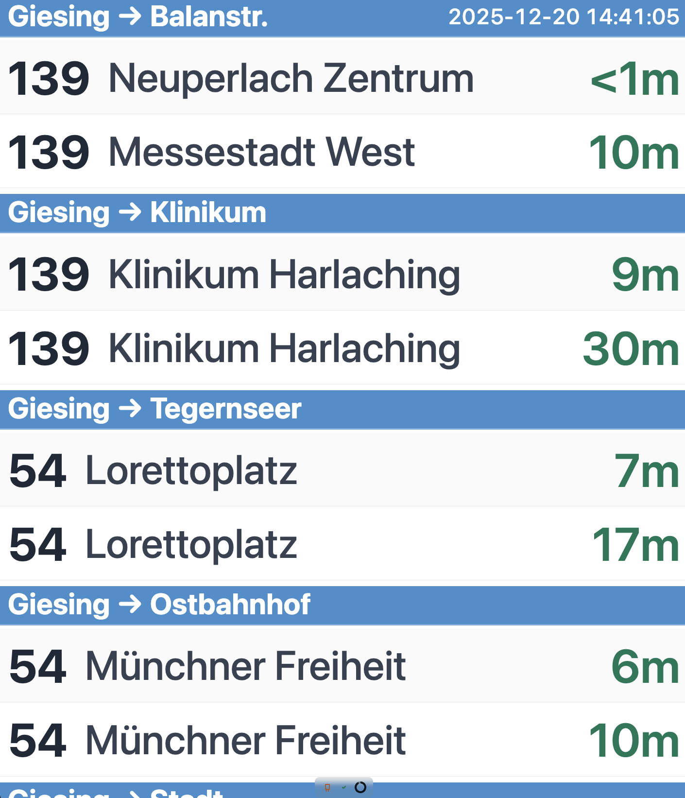
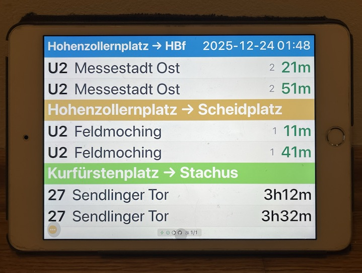

# My MVG Departures - a Customizable Departures Dashboard for Munich

A server-side rendered live dashboard for Munich public transport (MVG) departures. Featuring a responsive and live web UI. Usable on various screen sizes.



## Features

- **Live Departure Updates**: Real-time departure information from MVG API
- **Configurable Stops**: Monitor multiple stops with custom direction groupings
- **Responsive Design**: Clean, modern UI that works on all screen sizes
- **Dark/Light Mode**: Automatic theme switching based on system preferences
- **Flexible Time Display**: Show departures "in minutes" or "at" specific times
- **Direction Grouping**: Group routes by configurable direction names (e.g., "->Giesing")
- **12-Factor App**: Configuration via environment variables
- **Multiple Deployment Options**: Docker container or init.d service

> **⚠️ Important Disclaimer**: This dashboard is provided as a visual aid and should not be considered a definitive reference. Omissions, technical and logical errors, upstream MVG API dependencies, or incorrect configuration may result in incomplete or inaccurate dashboards. The discrepancy between real departures and planned departures may also be significant. Always verify critical departure information through official MVG channels.



## Requirements

- Python 3.12+
- Virtual environment tool: `uv`, `poetry`, `pipenv`, or `pyenv`

## Installation

### Quick Setup (Recommended)

The easiest way to set up the project is using the setup script:

```bash
# Clone the repository
git clone <repository-url>
cd my_mvg_departures

# Run the setup script (creates venv and installs dependencies)
./scripts/setup.sh
```

This will:

- Create a virtual environment (`.venv`)
- Install all dependencies
- Install the package in editable mode

### Manual Setup

#### Using uv (Recommended)

```bash
# Install uv if not already installed
curl -LsSf https://astral.sh/uv/install.sh | sh

# Clone and setup
git clone <repository-url>
cd my_mvg_departures
uv sync
```

#### Using Poetry

```bash
poetry install
poetry shell
```

#### Using pip

```bash
python3.12 -m venv .venv
source .venv/bin/activate  # On Windows: .venv\Scripts\activate
pip install -e .
```

## Configuration

Configuration uses a TOML file for stops and display settings. The preferred way is to set the `CONFIG_FILE` environment variable pointing to your TOML file:

```bash
export CONFIG_FILE=/path/to/your/config.toml
```

By default, the application uses [`config.example.toml`](config.example.toml) which includes a pre-configured Giesing stop.

### Quick Start

```bash
# Uses config.example.toml by default
./scripts/start.sh

# Or with custom config
export CONFIG_FILE=config.toml
./scripts/start.sh
```

### Environment Variables

- `CONFIG_FILE`: Path to TOML configuration file (default: [`config.example.toml`](config.example.toml))
- `HOST`: Server host (default: `0.0.0.0`)
- `PORT`: Server port (default: `8000`)
- `RELOAD`: Enable auto-reload for development (default: `false`)
- `TIME_FORMAT`: Display format - `minutes` or `at` (default: `minutes`)
- `REFRESH_INTERVAL_SECONDS`: Update interval in seconds (default: `30`)

### TOML Configuration Example

```toml
[display]
departures_per_page = 5
page_rotation_seconds = 8
pagination_enabled = true

[[stops]]
station_id = "de:09162:100"
station_name = "Giesing"
max_departures_per_stop = 30

[stops.direction_mappings]
"->Balanstr." = ["Messestadt", "Messestadt West"]
"->Klinikum" = ["Klinikum", "Klinikum Großhadern"]
"->Tegernseer" = ["Ackermannbogen", "Tegernseer"]
"->Stadt" = ["Gondrellplatz", "Marienplatz"]
```

**How Direction Mappings Work:**

- **Keys** (e.g., "->Giesing") are user-defined direction names that appear as headers in the UI
- **Values** are lists of destination patterns that match route destinations
- Patterns match destinations using substring matching (case-insensitive)
- Routes whose destinations don't match any pattern appear in an "Other" group
- You can group multiple different destinations under one direction name (e.g., all routes going toward Giesing area)

**Finding Station IDs:**

Use the `list_routes.sh` script to list routes for a station:

```bash
# List routes for a station by name
./scripts/list_routes.sh "Giesing"

# Or by station ID
./scripts/list_routes.sh de:09162:100
```

📖 **See [docs/FINDING_STOP_IDS.md](docs/FINDING_STOP_IDS.md) for more details.**

## Configuration Patterns

Configuration is flexible and depends on your specific use case. Here are some common patterns:

### Subset of Routes from a Complex Stop

If you're only interested in a subset of routes from a complex stop, you can configure this under one stop. However, beware that missing routes might result in an incomplete dashboard. Use direction mappings to filter only the routes you care about.

### Visual Distinction Between Destinations

If you need visual help distinguishing between destinations, turn on `random_header_colors` in your stop configuration. This assigns random colors to direction group headers, making it easier to visually separate different directions at a glance.

Colors are auto-generated using a hash-based algorithm that produces stable, pastel colors based on the header text. If you want different colors for the same headers, you can add `random_color_salt` to your stop configuration. Different salt values will produce different color palettes while maintaining color stability for each header.

Example:

```toml
[[stops]]
station_id = "de:09162:1110"
station_name = "Giesing"
random_header_colors = true
random_color_salt = 7  # Use salt 7 for this stop's color palette
```

### All Routes from a Particular Stop

If you're interested in all routes from a particular stop, there's no need to configure individual routes. A full global stop ID (search with the `list_routes.sh` script) will do. Don't forget to set `show_ungrouped = true` and optionally configure `ungrouped_title` to give ungrouped routes a meaningful header.

Example:

```toml
[[stops]]
station_id = "de:09162:1110:4:4"
station_name = "Giesing"
show_ungrouped = true
ungrouped_title = "Tegernseer Str."
```

### Touchable Screen vs Screen Height Filling Mode

The dashboard can be configured differently depending on the type of screen you're using:

**For Touchable Screens (iPad, tablets, phones):**
- Set `fill_vertical_space = false` (or omit it, as false is the default)
- This allows natural scrolling if content exceeds the viewport
- Better for interactive devices where users can scroll to see all content
- Recommended for personal devices or when you want to see all departures

**For Screen Height Filling Mode (Wall-mounted displays, kiosks):**
- Set `fill_vertical_space = true`
- This enables dynamic font sizing to fill the entire viewport height
- Content automatically scales to use the full screen height
- Use `font_scaling_factor_when_filling` to fine-tune the scaling (default: 1.0, lower values = smaller fonts)
- Recommended for permanent installations where you want maximum use of screen space

Example for wall-mounted display:

```toml
[display]
fill_vertical_space = true
font_scaling_factor_when_filling = 0.9  # Slightly smaller fonts for better fit
```

Example for touchable screen (default behavior):

```toml
[display]
fill_vertical_space = false  # or omit this line
```

### Experimentation and Tuning

Configuration is a lot about your preferences and use cases. Play with the numbers (departures per page, rotation intervals, max departures per route/stop) and run locally to get the desired results. The dashboard is designed to be highly customizable to match your specific needs.

## Usage

### Development

```bash
# Run with default config (config.example.toml)
./scripts/start.sh

# Or with custom config
export CONFIG_FILE=config.toml
./scripts/start.sh
```

Access the web UI at `http://localhost:8000`

### Production

#### Docker

```bash
# Build the image (uses optimized Dockerfile for minimal RAM usage)
docker build -f docker/Dockerfile.optimized -t mvg-departures-dashboard .

# Run with docker-compose (uses optimized Dockerfile)
docker-compose up

# Or run directly with custom config
docker run -d \
  -p 8000:8000 \
  -v /path/to/config.toml:/app/config.toml \
  -e CONFIG_FILE=/app/config.toml \
  mvg-departures-dashboard
```

#### Fly.io Deployment

For minimal RAM usage on Fly.io, use the optimized Dockerfile:

```bash
# Copy example config
cp fly.toml.example fly.toml

# Deploy (uses docker/Dockerfile.optimized by default)
fly deploy
```

The optimized Dockerfile provides:

- Pre-compiled wheels (faster startup, less memory)
- Removed Python cache files (smaller image)
- Minimal runtime dependencies
- Recommended for production deployments with memory constraints

#### Init.d Service

```bash
# Install as a system service (requires root)
sudo ./scripts/install-service.sh

# Configure stops - copy and edit the TOML config file
# (The install script will show you the exact paths)
sudo cp /opt/mvg-departures/config.example.toml /opt/mvg-departures/config.toml
sudo nano /opt/mvg-departures/config.toml

# Set CONFIG_FILE in .env if using a different path
sudo nano /opt/mvg-departures/.env

# Start the service
sudo service mvg-departures start

# Check status
sudo service mvg-departures status

# View logs
sudo tail -f /var/log/mvg-departures.log
```

#### iPad Deployment with Guided Access (Kiosk Mode)

This dashboard is perfect for deployment on an iPad as a permanent departure display. Apple's Guided Access feature allows you to lock the iPad to a single app, creating a kiosk-like experience.

**Prerequisites:**

- iPad (any model with iOS support)
- The server running and accessible on your network
- Safari browser (or any modern browser)

**Setup Steps:**

1. **Start the Server:**

   ```bash
   # On your server/computer, start the application
   ./scripts/start.sh
   # Or if running as a service:
   sudo service mvg-departures start
   ```

2. **Configure iPad Network:**

   - Connect iPad to the same network as your server
   - Note the server's IP address (e.g., `192.168.1.100:8000`)

3. **Open Dashboard in Safari:**

   - Open Safari on the iPad
   - Navigate to `http://YOUR_SERVER_IP:8000` (replace with your server's IP)
   - Wait for the page to load completely
   - Tap the Share button (square with arrow)
   - Select "Add to Home Screen"
   - Give it a name like "MVG Departures"
   - Tap "Add"

4. **Enable Guided Access:**

   - Open iPad Settings → Accessibility → Guided Access
   - Toggle "Guided Access" to ON
   - Tap "Passcode Settings" → "Set Guided Access Passcode"
   - Enter a passcode (you'll need this to exit Guided Access)
   - Optionally enable "Accessibility Shortcut" for quick access

5. **Activate Guided Access:**

   - Open the "MVG Departures" app from the home screen
   - Triple-click the Home button (or Side button on newer iPads)
   - If prompted, enter your passcode
   - Tap "Start" in the top-right corner
   - The iPad is now locked to this app

6. **Configure Guided Access Options (Optional):**

   - While in Guided Access setup, you can:
     - Disable touch in certain areas (tap areas to disable)
     - Disable motion (prevent screen rotation)
     - Disable buttons (Home button, volume buttons, etc.)
     - Set time limits (auto-exit after a period)

7. **Exit Guided Access:**
   - Triple-click the Home/Side button
   - Enter your Guided Access passcode
   - Tap "End" in the top-left corner

**Tips for Best Experience:**

- **Keep iPad Charged:** Use a wall charger or dock to keep the iPad powered
- **Auto-Lock Settings:** Set iPad to never auto-lock (Settings → Display & Brightness → Auto-Lock → Never or another setting if you have physical access to the ipad to wake the screen up)
- **Screen Brightness:** Adjust to your preference, or enable Auto-Brightness
- **Network Stability:** Ensure stable Wi-Fi connection for reliable updates
- **Wall Mount:** Consider a wall mount or stand for permanent installation
- **Full Screen:** The dashboard is designed to work in full-screen mode

**Troubleshooting:**

- **Dashboard not updating:** Check that the server is running and accessible
- **Connection issues:** Verify iPad and server are on the same network
- **Page refresh needed:** Exit and re-enter Guided Access to reload the page
- **WebSocket errors:** Check server logs for connection issues

**Alternative: Using Shortcuts App for Auto-Launch**

For even more automation, you can use the Shortcuts app to automatically open the dashboard when the iPad wakes:

1. Open Shortcuts app
2. Create a new automation: "When iPad wakes"
3. Add action: "Open URLs" → Enter your dashboard URL
4. Disable "Ask Before Running"
5. The dashboard will automatically open when the iPad wakes

## Why This Dashboard?

### The Problem with Plain Departure Displays

Traditional departure displays show a simple list of upcoming departures from a single stop. While this works for basic information, it falls short when you need to make strategic decisions about your journey.

**Real-world scenario:** You're at home and need to get to work. You check multiple stops:

- Your local stop (e.g., "Giesing")
- A transfer stop (e.g., "Marienplatz")
- Your destination stop

A plain display shows you raw departure times from each stop, but your brain has to:

1. **Remember** departure times from multiple stops
2. **Calculate** transfer windows and connection possibilities
3. **Compare** different route options
4. **Decide** which combination minimizes waiting time

This mental calculation becomes overwhelming when you're dealing with:

- Multiple routes per stop
- Different directions (some going your way, some not)
- Transfer connections with tight windows
- Real-time delays that affect your strategy

### How This Dashboard Helps

**Direction Grouping for Quick Comprehension:**
Instead of scrolling through a long list of mixed destinations, departures are grouped by direction (e.g., "->Balanstr.", "->Klinikum"). This lets you instantly see:

- Which routes are going your way
- How many options you have in each direction
- The timing spread across your preferred routes

**Strategic Limiting:**
By limiting departures per route and per group, the dashboard shows you the **most relevant information** without cognitive overload:

- **`max_departures_per_route`**: Shows 1-2 departures per route, so you see the next immediate options without being overwhelmed by future departures of the same route
- **`max_departures_per_stop`**: Limits total departures per direction, focusing on the near-term decisions you need to make

This design philosophy recognizes that **you don't need to see every departure**—you need to see the departures that matter for your immediate decision-making. The limits ensure the information density matches your cognitive capacity for quick strategic planning.

**Result:** Instead of mental arithmetic across multiple stops, you can quickly scan grouped departures, identify your best options, and make confident decisions about when to leave and which route to take.

## UI Features

### Responsive Layout

- **Route Number**: Fixed position on the left (3-4rem width)
- **Destination**: Flexible middle section with text overflow handling
- **Time**: Fixed position on the right (4-5rem width)
- **Small Screens**: Automatically adjusts font sizes and spacing

### Time Display

- **Minutes Format** (default): Shows "5m", "<1m", or "now"
- **At Format**: Shows "14:30" style times

### Visual Indicators

- **Real-time Data**: Green color for real-time departures
- **Delays**: Warning color for significant delays (>1 minute)
- **Cancelled**: Strikethrough and reduced opacity

## Development

For development-related topics including running tests, code quality, and extending the application, see [docs/development.md](docs/development.md).

## License

This project is licensed under the Mozilla Public License 2.0 (MPL-2.0). See `LICENSE` file for details.

## Disclaimer

This project is **not an official project from the Münchner Verkehrsgesellschaft (MVG)**. It uses the unofficial MVG API and is intended for **private, non-commercial, moderate use** only. Please refer to the [MVG imprint](https://www.mvg.de/impressum.html) for usage restrictions.

## Contributing

Contributions are welcome! This project follows **trunk-based development**:

- All development happens in short-lived feature branches
- Feature branches merge directly to `main`
- `main` is always in a deployable state

See [docs/CONTRIBUTING.md](docs/CONTRIBUTING.md) for detailed contribution guidelines.

## Acknowledgments

- [mvg](https://github.com/mondbaron/mvg) - MVG API library
- [pyview](https://github.com/ogrodnek/pyview) - Python LiveView implementation
- [DaisyUI](https://daisyui.com/) - Component library
- [Heroicons](https://heroicons.com/) - MIT-licensed SVG icons used for connection status indicators

## Alternative

### VVO Departure Monitor

A superb go-to alternative is the [VVO Build your own departure monitor](https://www.vvo-online.de/en/timetable/timetable-for-developers/departure-monitor/index.cshtml), based
on the [HAFAS](https://gist.github.com/derhuerst/2b7ed83bfa5f115125a5) endpoint.

Online demo: [VVO Iframe Example](https://d-led.github.io/my-mvg-departures/vvo-iframe/ostbahnhof/index.html)
